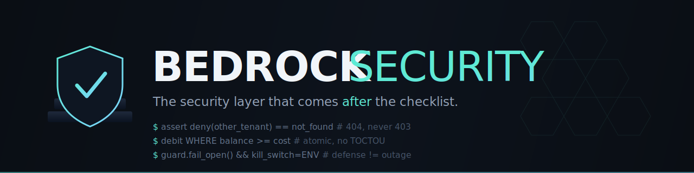

<div align="center">



# Bedrock Security

**Second-order application security — the hardening, testing, and decision-making that comes _after_ the OWASP checklist.**

A battle-tested security playbook, packaged as a [Claude Code](https://docs.claude.com/en/docs/claude-code) **skill** that auto-loads when you work on security — and equally readable as a standalone reference for any engineer.

[](#use-it-as-a-claude-code-skill)
[](LICENSE)
[](#whats-inside)
[](CONTRIBUTING.md)

</div>

---

## Why this exists

Generic security advice — _use HTTPS, hash passwords, parameterize queries, follow
the OWASP Top 10_ — is the **floor, not the ceiling**. Every AI assistant and
every checklist gives you that. It's necessary and it's table stakes.

What it _doesn't_ give you is the **second-order layer**: the non-obvious failure
modes, the decision frameworks, and the falsifiable test methodology that separate
"passed a checklist" from "survives a motivated attacker and a 3am incident."

Bedrock Security encodes that layer. It deliberately **skips the basics** and goes
straight to the stuff people learn the hard way — usually after something breaks
in production.

> **Example of the difference:**
> Generic: _"Check the user owns the object."_
> Bedrock: _"Return **404, not 403**, for an object owned by someone else — a
> 403/404 differential leaks the resource's existence and lets an attacker
> enumerate valid IDs. Scope the lookup by `(owner_id, object_id)` in the query
> itself, and make 'not yours' byte-indistinguishable from 'never existed'."_

## Run it — now an executable engine

Bedrock is no longer just a reading. It ships a **gated sweep engine** that frames a
target, decides what applies, and **proves each control with evidence** — refusing a
green verdict while anything applicable is still unproven.

```bash
python skill/engine/sweep.py <target-repo>      # add --run-commands for scanner probes
```

- **`skill/engine/registry.yaml`** — **76 checks** as machine-readable records (oracle ·
  applicability probe · proof method · pass criteria): the single source of truth.
- **`skill/engine/sweep.py`** — the runner; emits a PASS / FAIL / N-A / NEEDS-PROOF
  ledger and **exits non-zero while any applicable check is open** (the CI gate).
- **`skill/PROTOCOL.md`** — the forced 7-stage procedure (Frame → Applicability →
  Static → Adversarial → Decision → Triage → Verdict). Prove, never claim.
- **`skill/templates/`** — runnable adversarial proofs for Python/FastAPI, TypeScript/
  Node, and Supabase/Postgres.

## What's inside

| File | What it covers |
|---|---|
| [`skill/SKILL.md`](skill/SKILL.md) | The entry point: the 5 core principles, the completion gates, and the index. |
| [`skill/references/security-testing-methodology.md`](skill/references/security-testing-methodology.md) | **How to prove security instead of assuming it.** The grade-your-own-homework trap, isolation-authored falsifiable tests, oracle-anchoring, the Class 1–5 triage taxonomy, and **Anti-pattern #13** (test-order / state-leak — the silent regression-hider nobody documents). |
| [`skill/references/hardening-playbook.md`](skill/references/hardening-playbook.md) | The core controls and their **non-obvious failure modes**: BOLA status-leaks, the atomic check-and-debit race fix, X-Forwarded-For trust (done right), composite rate-limit keys, multi-worker counter inflation, pre-bcrypt lockout placement, JWT hardening, security headers, CWE-532 secret-scrubbing. |
| [`skill/references/ai-llm-security.md`](skill/references/ai-llm-security.md) | **LLM/AI security**: the two attack directions, the cost-aware escalation ladder (cheap regex → managed guardrails), a zero-dependency Tier-1 guard pattern, fail-open + kill-switch design, and the ReDoS check every regex guard needs. |
| [`skill/references/secrets-and-ops.md`](skill/references/secrets-and-ops.md) | **Secrets, env & secure ops**: the fail-open vs fail-closed decision table, secrets/env do's & don'ts, the deploy footguns (wrong account, push≠deploy, local-ahead divergence, multi-worker state), and incident-time muscle memory. |
| [`skill/references/more-controls.md`](skill/references/more-controls.md) | The rounding-out controls: **SSRF**, inbound **webhook signature verification**, **timing-safe comparison**, **idempotency keys**, **request-size/decompression limits**, **dependency/supply-chain** hygiene, **audit-log integrity**, and **CSRF/cookie nuance for SPAs**. |
| [`skill/engine/`](skill/engine) | **The sweep engine** — `registry.yaml` (76 structured checks), `sweep.py` (the gated runner), and the schema/probe reference. |
| [`skill/PROTOCOL.md`](skill/PROTOCOL.md) | The **forced, ordered procedure** that drives a sweep and gates the "secure" claim. |
| [`skill/templates/`](skill/templates) | **Per-stack adversarial proof templates** (pytest+httpx · vitest+supertest · Supabase RLS/SQL). |
| [`skill/references/framework-mappings.md`](skill/references/framework-mappings.md) | Every check crosswalked to **OWASP Top 10 / API Top 10, MITRE ATT&CK, NIST CSF, D3FEND, ATLAS, AI RMF**. |
| [`skill/references/cyber-skills-catalog.md`](skill/references/cyber-skills-catalog.md) | The **754-skill DFIR/offensive corpus** (Apache-2.0) captured by reference — which techniques became checks, and how to pull a playbook on demand. |

## The ideas you won't find in one generic doc

- **Your own tests lie to you by default.** When the same mind writes the code and
  the test, the test encodes your assumptions, not the security property. The fix:
  *isolation-authored, oracle-anchored, adversarial* tests. ([methodology](skill/references/security-testing-methodology.md))
- **Anti-pattern #13 — "passes in isolation, fails in batch."** A green CI run
  tells you nothing if your security tests are order-dependent. Root causes
  (shared in-memory DB connections, module-global capture vs late binding,
  last-importer-wins overrides, leaking RNG seeds) and their fixes. ([methodology](skill/references/security-testing-methodology.md))
- **The fail-open vs fail-closed table.** Auth fails *closed*; a rate limiter or an
  LLM guard fails *open* (a bug in the defense must not take down the product).
  Decide deliberately, per control. ([secrets-and-ops](skill/references/secrets-and-ops.md))
- **Cost-aware guardrail escalation.** A control that doubles your per-request cost
  gets disabled the first busy day. The cheap-but-80% layer that stays on beats the
  expensive-but-99% layer that gets removed. ([ai-llm-security](skill/references/ai-llm-security.md))
- **Every new control ships with a kill switch.** An env flag that disables it in
  seconds, no redeploy — because you can't safely turn a blocking control *on*
  unless you can turn it *off* fast. ([SKILL.md](skill/SKILL.md))

## Use it as a Claude Code skill

[Claude Code](https://docs.claude.com/en/docs/claude-code) auto-loads skills based
on what you're working on. Drop this in and it fires whenever you're setting up,
reviewing, or testing security.

```bash
# Clone into your Claude Code skills directory
git clone https://github.com/<your-org>/bedrock-security.git \
  ~/.claude/skills/bedrock-security-src

# Symlink (or copy) the skill payload so Claude Code sees it
ln -s ~/.claude/skills/bedrock-security-src/skill ~/.claude/skills/bedrock-security
```

Or copy `skill/SKILL.md` + `skill/references/` into `~/.claude/skills/bedrock-security/`.
The `SKILL.md` frontmatter (`description` + `triggers`) drives auto-firing on terms
like _harden, rate limit, BOLA, secrets management, prompt injection, security
testing, JWT, secure deploy_.

## Use it as a plain reference

You don't need Claude Code. Every file is standalone Markdown — read
[`skill/SKILL.md`](skill/SKILL.md) top-to-bottom, then pull the reference that
matches your task. Each control follows the same shape: **failure mode → fix →
oracle** (the OWASP/RFC/CWE citation that defines "correct").

## Who it's for

- Engineers shipping a real product who've done the OWASP pass and want the next layer.
- Teams hardening multi-tenant SaaS, APIs, or LLM-backed apps.
- Anyone writing security *tests* who's tired of green suites that prove nothing.
- AI coding agents that need the depth a generic prompt won't surface.

## Scope & limits

This is an **opinionated, experience-derived playbook**, not a compliance
certification or a substitute for a professional audit / pentest on a
high-stakes system. It assumes the basics are already done. Citations point to the
authoritative source (OWASP, RFCs, CWE) so you can verify every claim — please do.

## Contributing

Found a sharper failure mode, a missing second-order control, or an error? PRs and
issues welcome — see [CONTRIBUTING.md](CONTRIBUTING.md). The bar: it must be
**non-generic** (beyond the checklist), **falsifiable** (testable), and
**oracle-anchored** (cite the standard).

## License

[MIT](LICENSE) — use it, fork it, ship safer software.

---

<div align="center">
<sub>Bedrock Security · the layer after the checklist · built from real production scars</sub>
</div>
